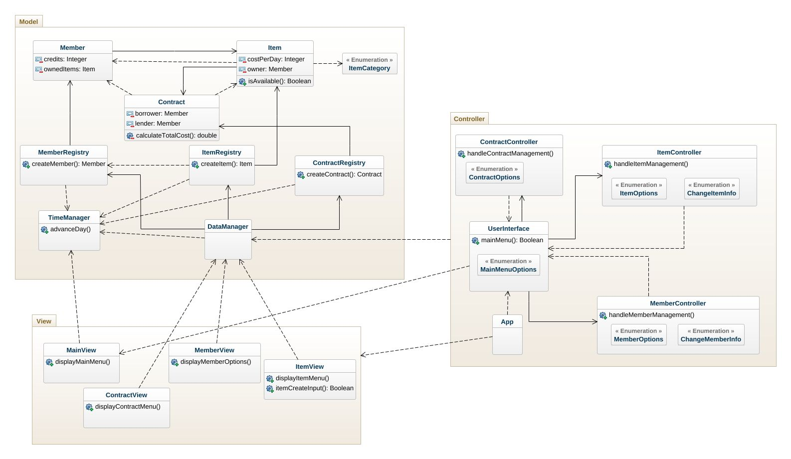
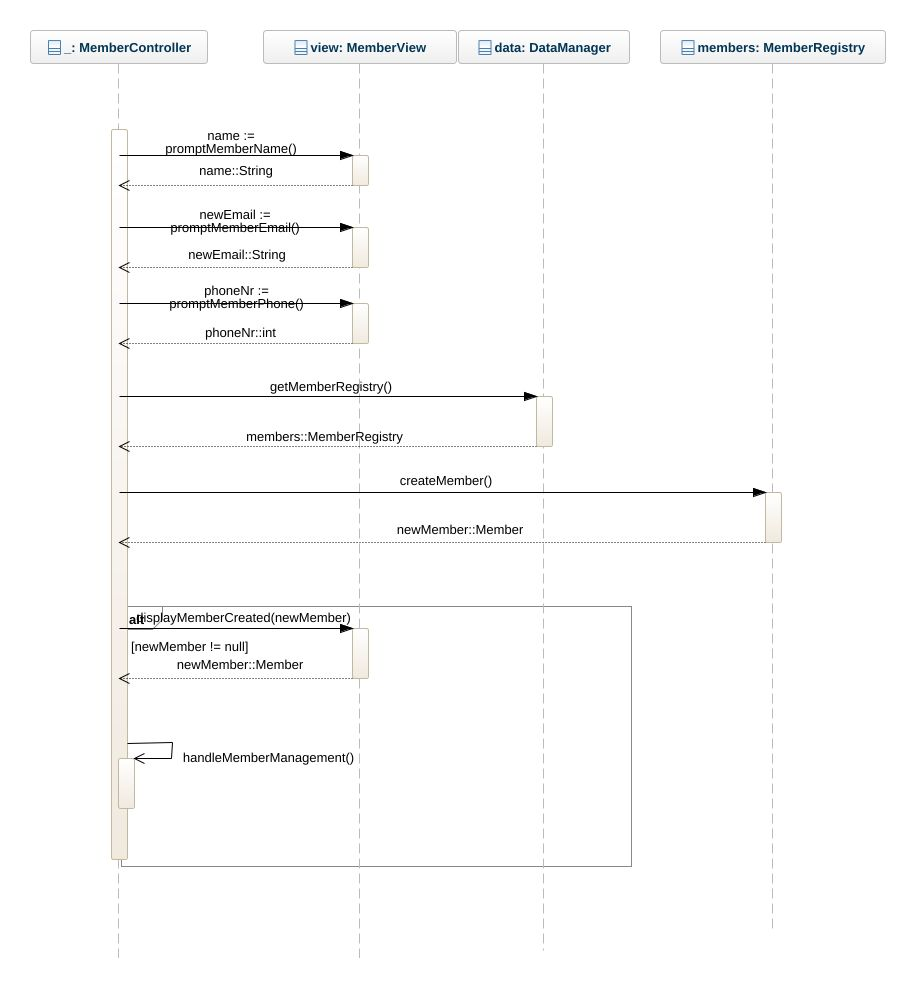
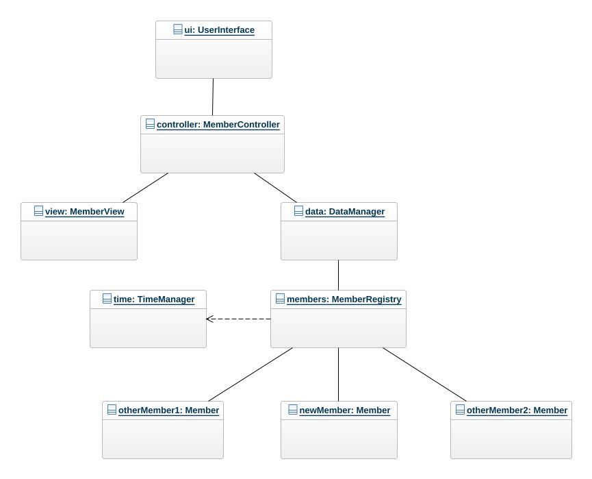

# Stuff lending System OO-Design
This document describes the design according to the requirements presented in assignment 2.

## Architectural Overview
The application uses the model-view-controller (MVC) architectural pattern. The view is passive and gets called from the controller. The view may only read information from the model, not directly change it.

## Detailed Design
### Class Diagram

### Sequence Diagram

This sequence diagram illustrates the method calls and communication between the objects when user creates a new member is creating a new member. The requirement for the sequence diagram is very vague so to our assumption this is simply the requirement, to merely show the process of adding one member by user input.

### Object Diagram

